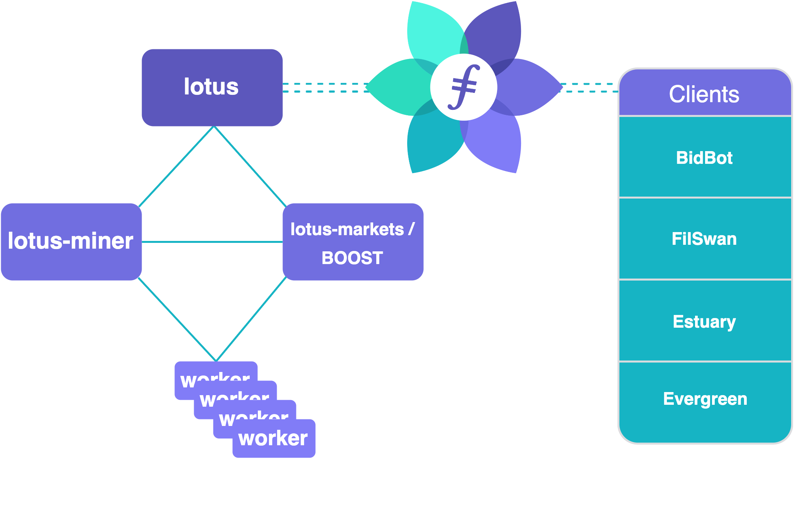

This section contains guides to initialize and run a successful storage provider operation using Lotus and should be approached by **advanced users only**. You should read through and be familiar with the concepts outlined in these two articles: [how Filecoin works](https://docs.filecoin.io/about-filecoin/how-filecoin-works/), [how mining works](https://docs.filecoin.io/mine/how-mining-works/), as well as having a Lotus node running.

At a high level, this section will cover documentation and guides about the `lotus-miner` and `lotus-worker` binaries, as well as how to use the built-in legacy lotus-markets. For documentation about Boost, you can check out the [Boost documentation](https://boost.filecoin.io)


Being a storage provider on the _mainnet_ has stringent minimal **[hardware requirements]()**. Do not attempt this installation if your server does not meet the minimum requirements.


## How to read the storage provider documentation

The guides in this section are meant to introduce high-level concepts early in the documentation and bring in more advanced topics and configurations later on. 

- The `Get started` segment contains a high-level overview of the tasks the `lotus-miner` binary does, introduces the basic economics of being a storage provider, and outlines some hardware and architectural requirements.
- The `Setup` segment contains all the necessary information for initializing the storage provider on the network.
- The `Operate` segment contains the necessary information about operating the storage provider daily and introduces more complex operations like SnapDeals, Batching and Index Provider.
- The `Workers` segment contains guides for setting up dedicated workers for offloading tasks from the `lotus-miner` binary.
- The `Advanced onfigurations` segment details all the configurations you can tune to optimize your storage provider setup.

We recommend careful reading of every existing section and gaining as much background as possible before proceeding with a Lotus storage provider deployment.

## Key concepts
You should be familiar with these key concepts related to being a storage provider before moving on to the next page. The Filecoin [glossary](https://spec.filecoin.io/#section-glossary) is handy when you need to look up a word or subject.

### Sectors

A sector is the default unit of storage that storage providers submit to the Filecoin network. Storage providers can decide if they want to commit 32 GiB or 64 GiB sector sizes when they first initialize their storage provider. It´s not possible to change the sector size once it has been initialized on-chain.

A sector can contain data from multiple deals and clients. A storage provider can also submit “Committed Capacity” (CC) sectors. CC sectors are available to the Filecoin network as committed storage power but do not initially contain storage deals. Actively proving CC sectors can be upgraded at a later date to include storage deals in a process known as Snap Deals.

**Sealed sectors**
An unsealed sector contains raw storage deal data. These sectors may optionally be retained if the client requires fast retrieval of their data.

**Unsealed sectors**
An unsealed sector is the raw data. Some clients request that their unsealed data is kept for fast retrievals.

### Epoch

The passing of time on the Filecoin network is divided into epochs of 30 seconds in duration. For every new epoch, a subset of storage providers are elected to add a new block to the chain.